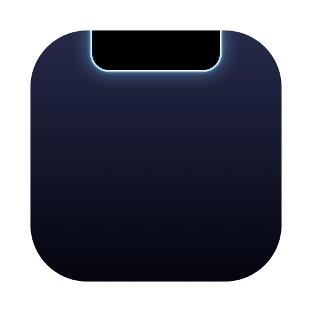
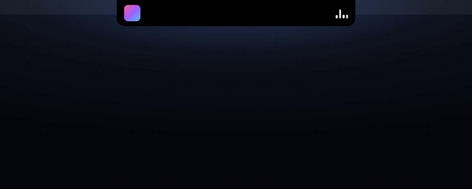
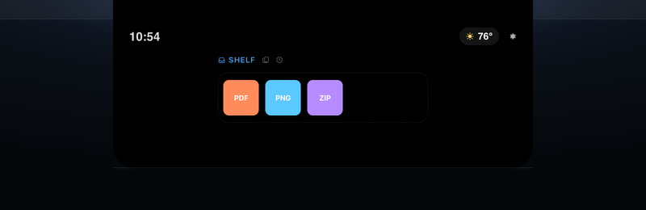
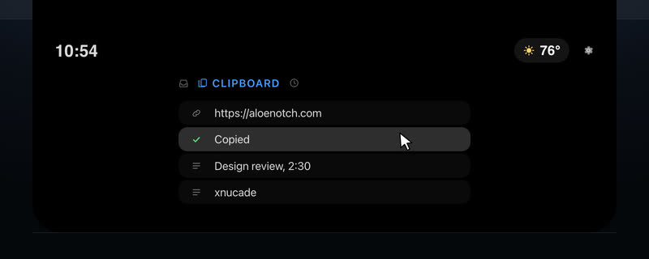
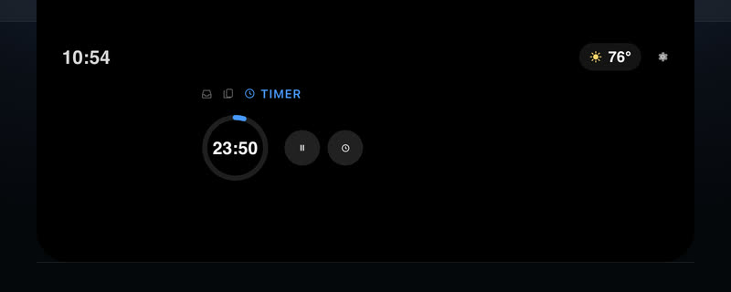

<p align="center">
  
</p>

<h1 align="center">AloeNotch</h1>

<p align="center">
  <b>Your MacBook's notch, awake.</b><br>
  A Dynamic Island for the Mac — free, open source, and invisible until you hover.
</p>

<p align="center">
  <a href="https://aloenotch.com/#download"><b>Download for macOS</b></a> ·
  <a href="https://aloenotch.com">Website</a> ·
  <a href="https://aloenotch.com/#tour">45-second tour</a> ·
  <a href="https://aloenotch.com/changelog">Changelog</a>
</p>

<p align="center">
  
</p>

<p align="center">
  <sub>Apple Silicon · macOS 26 or later · 1.6 MB download · 37 MB in memory · under 1% of one core when idle · MIT</sub>
</p>

---

## What it does

Collapsed, AloeNotch hugs the hardware notch to the pixel — pure black, nothing
added. Hover it, or press **⌃⌥N**, and it opens into a panel.

| | |
|---|---|
| **Now Playing, everywhere** | Apple Music, Spotify, even YouTube in a browser tab. Artwork, title, transport controls and a scrubber you can drag. |
| **Ambient Glow** | The artwork's colour traces the panel's edge — a thin line of light around the notch. |
| **The Shelf** | Drag a file onto the notch and it opens to catch it. Files persist across launches; drag them back out one at a time or all at once. |
| **Clipboard history** | The last 24 things you copied, one click to copy again. Memory only — never written to disk — and anything a password manager marks private is skipped. |
| **A timer** | Start one from the panel and it takes over the collapsed strip while it counts down. |
| **Your day at a glance** | The next 24 hours of your calendar, local weather with an hourly forecast, and a clock. |
| **Volume & brightness** | Optional replacement for the macOS HUD, with bars in white, your accent, a colour each, or tinted by whatever's playing. |
| **Sound output** | Switch between speakers, AirPods and displays from the panel header. |
| **Keep awake** | One click stops the display sleeping; the assertion is released automatically if the app quits or crashes. |
| **Battery** | Charge level, a bolt while plugged in, and a quiet warning when you're low. |
| **Motion you can dial** | Calm, Standard or Lively — choose how much the panel overshoots when it opens. Closing never bounces, because the collapsed strip has to land on the notch exactly. Reduce Motion always wins. |

No notch? On other displays it draws its own strip in the same place, and
everything works the same way.

<p align="center">
  
  
  
  
</p>

## Privacy

- **No analytics, no telemetry, no account.**
- **Two network requests, both optional:** weather for your approximate
  location ([Open-Meteo](https://open-meteo.com), no key), and a once-a-day
  check of this repo's releases for a newer version. Either can be switched off.
- **No permissions to start with.** Calendar and Location are requested only
  when you turn those modules on; Accessibility only if you want the volume and
  brightness HUD replaced. The keyboard shortcut uses Carbon hot keys and needs
  no permission at all.

## Install

1. [Download the .dmg](https://aloenotch.com/#download) and drag AloeNotch to Applications.
2. The first launch is blocked because the app isn't notarized yet: open
   **System Settings → Privacy & Security**, scroll down, and click
   **Open Anyway**. You only do this once.
3. AloeNotch lives in the menu bar. Hover the notch.

It checks for updates once a day and tells you in the menu bar; replacing the
app keeps your settings and permissions.

**Intel Mac or macOS 15?** [0.6.0](https://aloenotch.com/#download) is the final
build for you. It still works, but it no longer gets features or fixes.

---

## Building from source

Requires Xcode 26 on Apple Silicon.

1. Open `OpenNotch.xcodeproj` and select the **OpenNotch** scheme with a
   **My Mac** destination.
2. Set a signing identity (see [Signing](#signing)).
3. Press **⌘R**.

> **About the name.** The product is **AloeNotch** (bundle id
> `com.kadeslab.AloeNotch`), but the Xcode project, scheme, source folder and
> `.entitlements` are still named `OpenNotch`. The internal name isn't
> user-visible, and renaming a file-system-synchronised Xcode project by hand
> isn't worth the risk.

### Tests

```sh
./scripts/run-tests.sh
```

The pure logic — panel-state precedence, version comparison, clipboard history,
countdown maths, motion presets and readout contrast — is compiled directly
without an Xcode target, so the suite runs in about a second.

### Signing

The project signs with a certificate named **AloeNotch Signing**. Without it the
build fails with "No signing certificate found": set **Signing & Capabilities →
Signing Certificate** to *Sign to Run Locally*, or create your own as below.

<details>
<summary>Why not just sign ad-hoc?</summary>

Ad-hoc signing makes the app's designated requirement a hash of the binary:

```
designated => cdhash H"6f08e071…"
```

macOS privacy permissions are keyed to that requirement, so **every rebuild is a
different app** to the system — Calendar, Location and Accessibility grants are
silently dropped each time you build, and each time a user installs an update.
With a stable certificate the requirement becomes:

```
designated => identifier "com.kadeslab.AloeNotch" and certificate root = H"c90b8b3f…"
```

which is identical across builds, so permissions persist.

**Creating one:** Keychain Access → **Certificate Assistant → Create a
Certificate…**, name it `AloeNotch Signing`, Identity Type *Self Signed Root*,
Certificate Type *Code Signing*.

**Back it up**, private key included. Signing a future release with a different
identity resets every user's permissions again, so the certificate is part of
the app's identity.

A Developer ID certificate is strictly better — same stability, plus
notarization, which removes the first-launch prompt:

```sh
SIGN_IDENTITY="Developer ID Application: Your Name (TEAMID)" ./scripts/make-dmg.sh
```
</details>

### How it's put together

| Area | Where | Notes |
|------|-------|-------|
| App lifecycle | `OpenNotchApp.swift`, `AppDelegate.swift` | Menu-bar accessory, no Dock icon |
| Notch geometry | `Notch/NotchGeometry.swift` | `NSScreen.safeAreaInsets` and the auxiliary top areas |
| Window | `Notch/NotchPanel.swift`, `NotchWindowController.swift` | Borderless, non-activating `NSPanel` above the menu bar |
| Click-through | `Notch/PassthroughHostingView.swift` | Only the live notch rect takes mouse events |
| State | `Notch/NotchViewModel.swift`, `Notch/PanelState.swift` | Owns the feature managers; pure expand/collapse precedence |
| Live activities | `Notch/LiveActivity.swift`, `ActivityDetectors.swift` | HUDs, timer and other things that take over the strip |
| Motion | `Design/Theme.swift`, `Design/MotionPersonality.swift` | Springs, bounce presets, readout colours and contrast floor |
| Media | `Media/*` | mediaremote-adapter engine and now-playing manager |
| Shelf | `Tray/TrayModel.swift`, `Views/TrayView.swift` | Files persisted as bookmarks, so they survive being moved |
| Clipboard | `System/ClipboardManager.swift`, `ClipboardHistory.swift` | Pasteboard polling; honours nspasteboard.org concealed/transient types |
| Timer | `Timer/*` | Deadline-based, so it doesn't drift |
| System | `System/*` | Carbon hot key, CoreAudio output, IOPM keep-awake, volume/brightness |
| Settings | `Settings/*`, `Views/Settings/*` | Preferences window and menu-bar switchboard |

### Now Playing uses a private framework

`MediaRemote` is undocumented, and since macOS 15.4 Apple restricts its
now-playing APIs for third-party apps. AloeNotch reads it through the vendored
[mediaremote-adapter](https://github.com/ungive/mediaremote-adapter) (BSD-3),
and if that ever stops working the media panel says so rather than crashing.
Because it relies on private API, AloeNotch can't ship on the Mac App Store and
could break with a macOS update.

## Contributing

Issues and pull requests are welcome. For anything bigger than a fix, open an
issue first so we can talk it through. [docs/design](docs/design) has the
reasoning behind the motion and readout decisions.

If AloeNotch is useful to you, a ⭐ helps other people find it — and you can
[follow along on X](https://x.com/xnucade) for releases.

## License

[MIT](LICENSE). Not affiliated with Apple.
